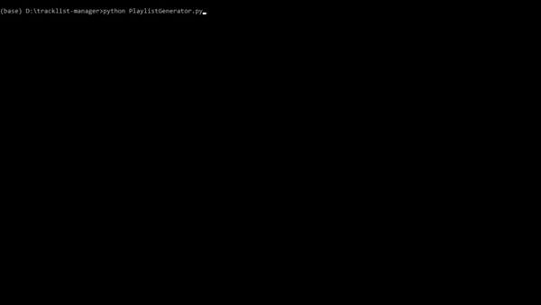

# BeatNΞxus

[](https://www.python.org/downloads/)
[](https://github.com/sicktrick-237)

BeatNexus is a python based web application which lets you save tracklists from 1001 Tracklists and MixesDB, directly to your YouTube or Spotify playlists.

Note: For Access (client secret), please follow the steps below.

## New Additions

* Now you can save your favourite Tracklists on Spotify.
* Also, you are now able to save your MixesDB tracklists to YouTube and Spotify.

## Packages

All the required packages are found on PyPI

[](https://pypi.org/project/apiclient/)
[](https://pypi.org/project/google-auth-httplib2/)
[](https://pypi.org/project/beautifulsoup4/)
[](https://pypi.org/project/selenium/)
[](https://pypi.org/project/tqdm/)

## Links

* All the Packages used in this project are included in Anaconda Distribution. You can download it <a href="https://www.anaconda.com/distribution/">here</a>.
* List of Radio Shows, Festival Mixes and Guestmix can be found on <a href="https://www.mixesdb.com/db/index.php/Main_Page">MixesDB</a> & <a href="https://www.1001tracklists.com">1001Tracklists</a>

## Installation
Install above packages with pip. Example.
```
$ pip install apiclient
```

## Usage

### Command Line Interface

* Install the dependencies and change the running directory to project directory.
    ```
    $ cd tracklist-manager 
    $ python PlaylistGenerator.py
    ```
* Enter your favourite 1001 or MixesDB Tracklist URL. Take this for <a href="https://www.1001tracklists.com/tracklist/g5tm74k/dada-life-podcast-december-2019-12-18.html">Example</a>
    ```
    Enter 1001Tracklist or MixesDB URL :
    ```

### Demo



### Jupyter Notebook

Open PlaylistGenerator.ipynb in Jupyter and Run.

Follow the instructions as per required inputs.
